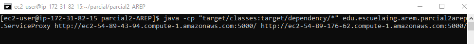
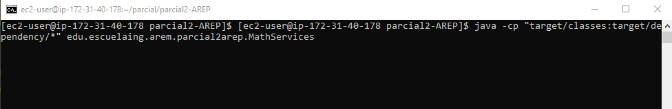
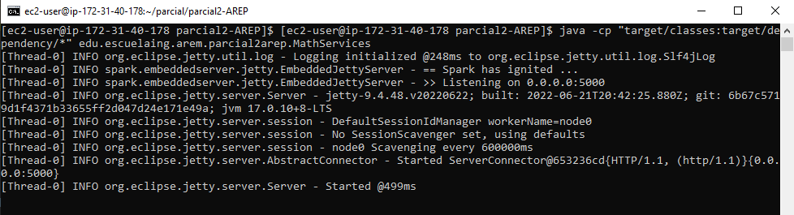
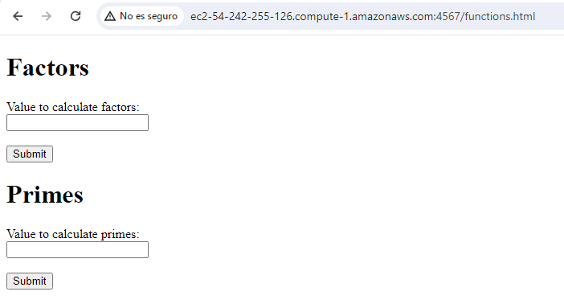
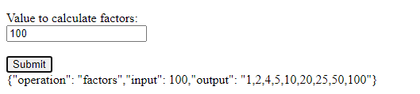
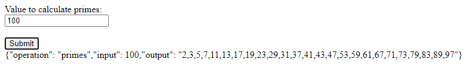

# Parcial 2 AREP

## Autor
Juan Felipe Sánchez Pérez

## Requisitos de instalación
* Vamos a implementar la arquitectura en la que se utilizan tres instancias de EC2, y cada una debe tener instaladas las siguientes herramientas: 
  * Java
  * Git
  * Maven
* En la instancia EC2 que va a usar como servidor proxy, permita el tráfico por el puerto 4567
* En las instancias EC2 que ejecutan `MathServices`, permita el tráfico por el puerto 5000

## Instrucciones para ejecución 
1. Una vez se tengan las tres instancias EC2, en dos de ellas vamos a ejecutar el servicio `MathServices`, y en otra el servicio fachada `ServiceProxy` que se conectará a las instancias que ofrecen los servicios de `MathServices`.
   Para ello, clone el repositorio en las tres instancias usando el comando:
    ```
      git clone https://github.com/juansanxz/parcial2-AREP.git
    ```

2. Ingrese a la carpeta del proyecto: `cd parcial2-AREP.git`.
3. Compile e instale las dependencias del proyecto usando el comando: 
   ```
      mvn clean install
   ```
4. Ahora, en la máquina virtual que definió como el servidor proxy, use el siguiente comando para ejecutar el servicio:
   ```
       java -cp "target/classes:target/dependency/*" edu.escuelaing.arem.parcial2arep.ServiceProxy {dns de la primera instancia ec2 que ejecuta MathService:5000/} {dns de la segunda instancia ec2 que ejecuta MathService:5000/}
   ```
    Por ejemplo, debe verse así:  
     
  
5. Luego, en las otras dos máquinas virtuales que se encargan de ejecutar el servicio de `MathService`, use el siguiente comando:  
  ```
    java -cp "target/classes:target/dependency/*" edu.escuelaing.arem.parcial2arep.MathServices
  ```  
    
  Verá algo como lo siguiente en ambas instancias Ec2:  
     

7. Ya se encuentra disponible el servicio para ser utilizado. Ingrese a la siguiente URL: `http://{dns de servidor proxy}:4567/functions.html`. En este caso, yo usé `http://ec2-54-242-255-126.compute-1.amazonaws.com:4567/functions.html`.  
    

8. Una vez aquí, podemos comprobar el funcionamiento de las dos funciones:  
  * La primera calcula los factores de un número:  
      
  
  * La segunda, calcula los primeros n números primos de acuerdo a un n dado:  
      

## Decisiones de diseño

* Para cumplir con los requerimientos definidos en la arquitectura, se hizo lo siguiente:
  1. La clase `ServiceProxy` cumple el rol de servidor proxy, que se comunica con el cliente para atender el servicio que le sea solicitado. Para ello, usa la clase `RemorteConnection` para realizar a trevés de esta los llamados a los servicios expuestos por `MathServices`. 
  2. `RemoteConnection` hace uso de un algoritmo de balanceo de cargas  Round Robin para enviar las solicitudes de forma secuencial a las dos instancias de Ec2 que atienden tal servicio.  
  3. Para saber a que URL solicitar el servicio, están son enviadas como argumentos a la función main de `ServiceProxy` (como se mencionó en el paso 4 de la sección _Instrucciones para ejecución_), quien se encarga a su vez de enviarlas a la clase `RemoteConnection` que tiene la lógica necesaria para llamar a las dos instancias de Ec2.
  4. `MathServices` contiene la lógica necesaria para las funciones _factors_ y _primes_. y construye un JSON con la respuesta.
  5. Una instancia de Ec2 ejecuta la clase `ServiceProxy`, y otras dos instancias ejecutan de forma simultánea el servicio `MathServices`. El cliente se comunica con el servidor proxy, y este último a través del algoritmo Round Robin, realiza la solicitud a alguna de las dos instancias que se encuentran ejecutando la clase `MathServices`.

## Video

A continuación se presenta el correcto funcionamiento e implementación de la arquitectura solicitada. En primer lugar, se observa la ejecución en cada instancia de Ec2 de las clases correspondientes, y luego se muestra el funcionamiento de los servicios al ser solicitados desde el cliente. Finalmente, se demuestra el dns usado, que corresponde a la instancia que ejecuta `ServiceProxy`.  
Para visualizar el video, de click sobre él, y luego presione _View raw_, lo cual descargará el mismo.
[video.mp4](img/video.mp4)

   
