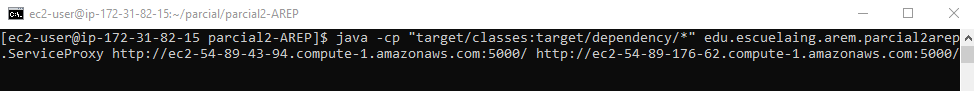
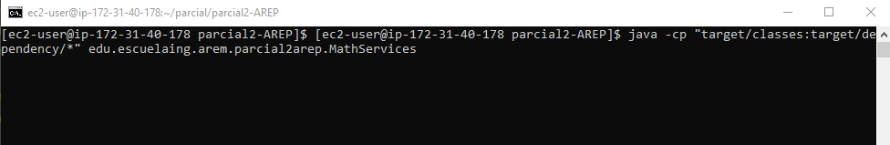
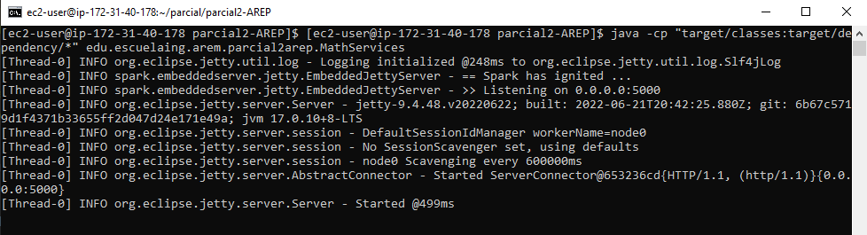
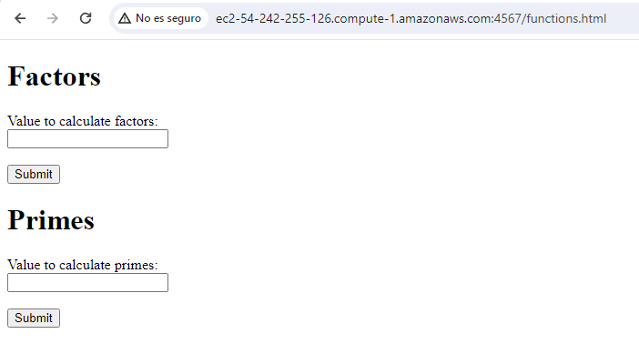
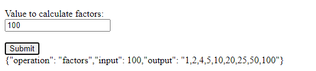
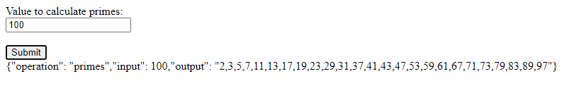

# Parcial 2 AREP

## Autor
Juan Felipe Sánchez Pérez

## Requisitos de instalación
* Vamos a implementar la arquitectura en la que se utilizan tres instancias de EC2, y cada una debe tener instaladas las siguientes herramientas: 
  * Java
  * Git
  * Maven
* En la instancia EC2 que va a usar como servidor proxy, permita el tráfico por el puerto 4567
* En las instancias EC2 que ejecutan `MathServices`, permita el tráfico por el puerto 5000

## Instrucciones para ejecución 
1. Una vez se tengan las tres instancias EC2, en dos de ellas vamos a ejecutar el servicio `MathServices`, y en otra el servicio fachada `ServiceProxy` que se conectará a las instancias que ofrecen los servicios de `MathServices`.
   Para ello, clone el repositorio en las tres instancias usando el comando:
    ```
      git clone https://github.com/juansanxz/parcial2-AREP.git
    ```

2. Ingrese a la carpeta del proyecto: `cd parcial2-AREP.git`.
3. Compile e instale las dependencias del proyecto usando el comando: 
   ```
      mvn clean install
   ```
4. Ahora, en la máquina virtual que definió como el servidor proxy, use el siguiente comando para ejecutar el servicio:
  ```
    java -cp "target/classes:target/dependency/*" edu.escuelaing.arem.parcial2arep.ServiceProxy {dns de la primera instancia ec2 que ejecuta MathService:5000/} {dns de la segunda instancia ec2 que ejecuta MathService:5000/}
  ```
  Por ejemplo, debe verse así:  
    
  
5. Luego, en las otras dos máquinas virtuales que se encargan de ejecutar el servicio de `MathService`, use el siguiente comando:
    
  Verá algo como lo siguiente en ambas instancias Ec2:  
     

6. Ya se encuentra disponible el servicio para ser utilizado. Ingrese a la siguiente URL: `http://{dns de servidor proxy}:4567/functions.html`. En este caso, yo usé `http://ec2-54-242-255-126.compute-1.amazonaws.com:4567/functions.html`.
    

7. Una vez aquí, podemos comprobar el funcionamiento de las dos funciones:
  * La primera calcula los factores de un número:
    
  
  * La segunda, calcula los primeros n números primos de acuerdo a un n dado:
    

## Decisiones de diseño

* Para cumplir con los requerimientos definidos en la arquitectura, se hizo lo siguiente:
  1. La clase `ServicProxy` cumple el rol de servidor proxy, que se comunica con el cliente para atender el servicio que le sea solicitado. 
  [video.mp4](video.mp4)

   
